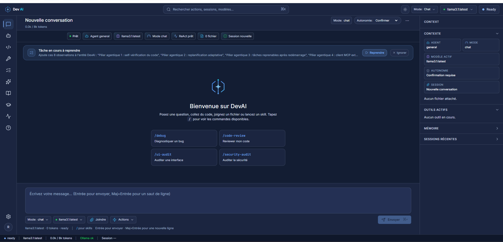
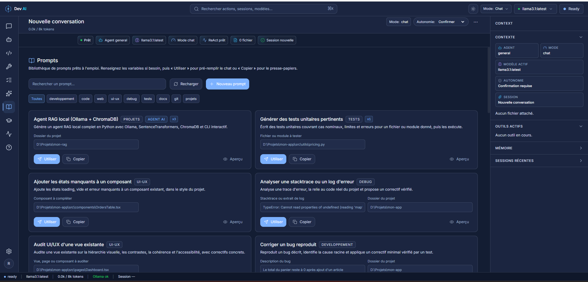
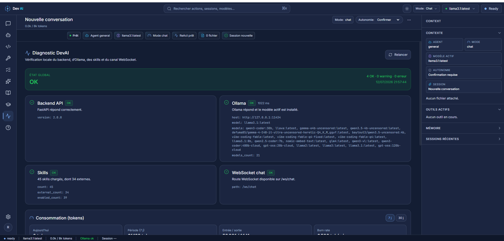
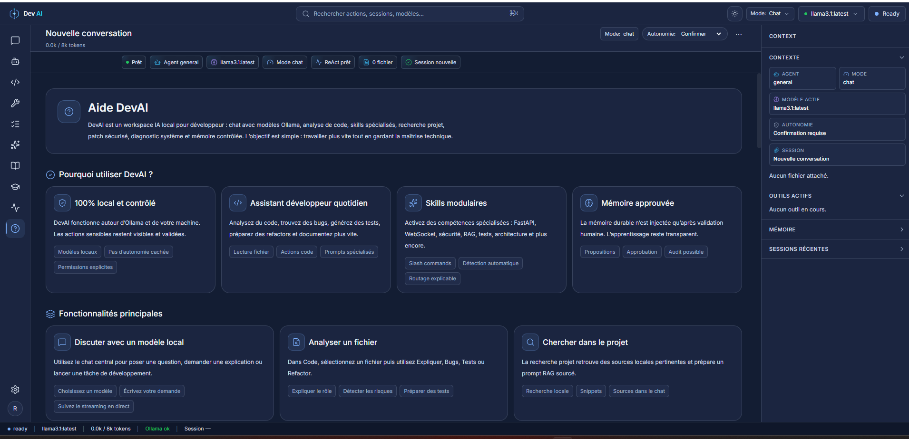

<div align="center">

# 🤖 DevAI

### Un agent de développement IA qui tourne **100 % sur votre machine**

Chat avec des modèles locaux, agent outillé, bibliothèque de prompts, mémoire
durable — **sans jamais envoyer votre code dans le cloud.**

[](https://github.com/Riadh35/DevAi/releases/latest)
&nbsp;


</div>

---



## En bref

**DevAI** est un poste de travail IA pour développeur qui s'exécute entièrement en
local. Il combine un **chat** avec vos modèles [Ollama](https://ollama.com), un
**agent capable d'agir** (lire/écrire des fichiers, lancer des commandes, chercher
sur le web) et une couche de **mémoire, de skills et de garde-fous** — le tout dans
une interface web moderne qui s'ouvre dans votre navigateur.

Contrairement aux assistants cloud, **rien ne quitte votre poste** : ni votre code,
ni vos conversations, ni vos données. C'est l'outil pensé pour ceux qui ne *peuvent*
pas (ou ne *veulent* pas) envoyer leur travail à un service tiers.

## Pourquoi DevAI ?

- 🔒 **Confidentialité totale.** Tout s'exécute en local via Ollama. Aucune
  télémétrie, aucun appel cloud, aucune fuite. Idéal pour le code sensible, le
  travail hors-ligne ou les contraintes de souveraineté des données.
- 🧰 **Un vrai agent, pas juste un chat.** Il lit et écrit des fichiers, exécute des
  commandes, navigue sur le web et analyse du code — avec **validation humaine**
  avant chaque action sensible.
- 📚 **Prêt à l'emploi.** Bibliothèque de prompts, skills spécialisés et modèles
  recommandés : vous êtes productif en quelques minutes.
- 🧠 **Il apprend votre projet.** Mémoire durable rappelée d'une session à l'autre —
  après votre approbation, jamais en douce.
- 🛟 **Sûr par conception.** Chaque fichier est sauvegardé avant modification, la
  mémoire est sauvegardée automatiquement, et vous choisissez le niveau d'autonomie.
- ⚡ **Léger et autonome.** ~130 Mo, aucune installation de Python requise. Seul
  Ollama (gratuit) est nécessaire.

---

## Fonctionnalités en détail

### 💬 Chat & agent outillé
Discutez avec n'importe quel modèle de votre installation Ollama, en streaming.
Au-delà de la conversation, l'agent suit une boucle de raisonnement **ReAct** et
dispose d'outils : lecture/écriture de fichiers, exécution de commandes, recherche
et navigation web, analyse de code, requêtes HTTP, lecture de PDF/CSV, et plus.
**Trois modes d'autonomie** : *Lecture seule* (aucune action), *Proposer* (l'agent
suggère), *Confirmer* (validation avant chaque action à risque).

### 📚 Bibliothèque de prompts
Des dizaines de prompts prêts à l'emploi, classés par catégorie (développement, code,
web, UI/UX, debug, tests, docs, git, projets). Un clic pour **pré-remplir le chat**
ou **copier** dans le presse-papiers, avec des variables à renseigner. Vous pouvez
**créer vos propres prompts** et retrouver les plus utilisés en tête de liste.

### 🧩 Skills modulaires
Activez des compétences spécialisées invocables par `/nom` (revue de code, debug,
sécurité, FastAPI, React, etc.). Les skills à permissions sensibles restent
**désactivés par défaut** — vous gardez le contrôle.

### 🧠 Mémoire durable & apprentissage
DevAI construit un **graphe de connaissances** de vos projets (faits, conventions,
pièges) et le rappelle automatiquement au bon moment. Après une tâche, il **propose**
une leçon : elle n'est appliquée qu'**après votre validation** — aucune
auto-modification opaque.

### ⚕️ Moteur Hermes (avancé)
Un moteur d'agent alternatif intégré, avec sa propre gestion de conversation et
d'outils, sélectionnable dans l'onglet **Agents** — pour ceux qui veulent une
autre approche agentique.

### 🔀 Routage automatique des modèles
Chaque tâche est dirigée vers le modèle le plus adapté de votre installation
(un modèle « code » pour coder, un modèle rapide pour les questions simples…),
sans configuration.

### 🛟 Filets de sécurité
- **Checkpoints fichiers** : chaque fichier est copié **avant** toute modification
  par l'agent — restauration en un clic depuis l'onglet Runs.
- **Sauvegardes mémoire** : le graphe et la base sont sauvegardés automatiquement au
  démarrage et à la demande, avec rotation.

### 📊 Diagnostic & suivi de consommation
Un onglet **Diagnostic** vérifie en un coup d'œil l'état du backend, d'Ollama, du
WebSocket et des skills, et affiche votre **consommation de tokens** (par jour, par
modèle, burn rate).

---

## Aperçu

| Bibliothèque de prompts | Diagnostic & consommation | Aide intégrée |
|:---:|:---:|:---:|
|  |  |  |

---

## Installation

### 1. Installer Ollama (le moteur de modèles local)
Téléchargez [Ollama](https://ollama.com), puis récupérez au moins un modèle :
```bash
ollama pull llama3.1:latest
```

### 2. Télécharger DevAI
Depuis la [dernière Release](https://github.com/Riadh35/DevAi/releases/latest) :
- **`DevAI-Setup.exe`** — installateur classique, **ou**
- **`DevAI-…-portable.zip`** — version portable : décompressez, puis lancez `DevAI.bat`.

### 3. Lancer
Ouvrez DevAI : l'application s'ouvre dans votre navigateur sur
`http://localhost:8000`. Pour l'arrêter, fermez la fenêtre.

> 💡 Aucune installation de Python n'est nécessaire — DevAI embarque son propre
> runtime. Seul **Ollama** est requis.

---

## Premiers pas

1. Ouvrez l'onglet **Diagnostic** pour vérifier qu'Ollama est bien détecté (vert).
2. Choisissez un modèle dans le sélecteur en haut à droite.
3. Posez une question dans le **Chat**, ou allez dans **Prompts** et cliquez sur
   « Utiliser » pour partir d'un prompt prêt à l'emploi.
4. Pour laisser l'agent agir sur vos fichiers, réglez l'**autonomie** sur *Confirmer*
   et validez chaque action proposée.

### Modèles recommandés
| Usage | Modèle Ollama suggéré |
|---|---|
| Généraliste / chat | `llama3.1:latest` |
| Code | `qwen2.5-coder:7b` |
| Léger / rapide | `llama3.2:3b` |

*(Tout modèle présent dans `ollama list` est utilisable.)*

---

## Configuration requise

- **Windows 10 / 11** (64 bits)
- **[Ollama](https://ollama.com)** installé et lancé
- **~130 Mo** d'espace disque (hors modèles Ollama)
- Au moins un modèle Ollama installé
- Un GPU accélère fortement les modèles, mais **n'est pas obligatoire** (CPU supporté)

---

## FAQ

**Mes données sortent-elles de ma machine ?**
Non. DevAI ne communique qu'avec Ollama, en local. Aucune télémétrie, aucun cloud.

**Faut-il une connexion internet ?**
Seulement pour installer Ollama et télécharger un modèle. Ensuite, tout fonctionne
hors-ligne (sauf si vous utilisez l'outil de recherche web).

**Faut-il savoir coder pour l'utiliser ?**
Non pour discuter et utiliser les prompts. Les fonctions d'agent (fichiers,
commandes) s'adressent surtout aux développeurs.

**Puis-je utiliser mes propres modèles ?**
Oui — tout modèle disponible dans `ollama list` est sélectionnable.

**DevAI modifie-t-il mes fichiers sans me demander ?**
Non, si vous laissez le mode *Confirmer* : chaque action à risque est validée par
vous. Et chaque fichier est sauvegardé avant modification.

---

## Dépannage

- **« Ollama indisponible »** → vérifiez qu'Ollama est lancé (icône dans la barre des
  tâches) et qu'un modèle est installé (`ollama list`).
- **Le port 8000 est occupé** → lancez `DevAI.bat` puis, si besoin, utilisez un autre
  port via `python serve.pyc --port 8123` (version portable).
- **Comportement étrange** → ouvrez l'onglet **Diagnostic** : il indique l'état du
  backend, d'Ollama, du WebSocket et des skills.

---

## Support

Un problème, une idée ? Ouvrez une
[issue](https://github.com/Riadh35/DevAi/issues).

---

<div align="center">
<sub>

DevAI — agent de développement IA **100 % local**.
Distribué en tant qu'application gratuite. Voir [`LICENSE`](LICENSE) et
[`NOTICE.txt`](NOTICE.txt) pour les conditions d'utilisation et les composants tiers.

</sub>
</div>
